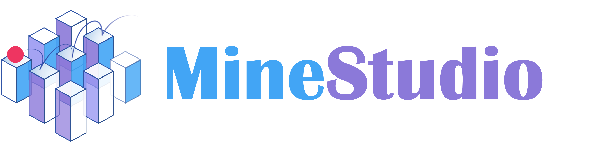
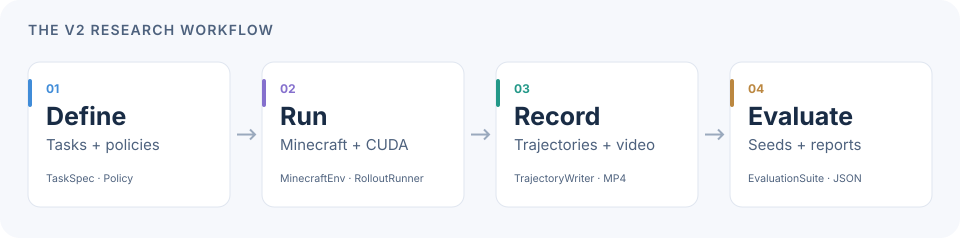
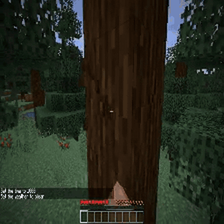

<div align="center">
  
  <p><strong>From the first action to a reproducible Minecraft experiment.</strong></p>
  <p>Build agents · Define tasks · Record trajectories · Evaluate behavior</p>
  <p>
    <a href="docs/architecture/progress.md"></a>
    <a href="docs/getting-started/installation.md"></a>
    <a href="https://github.com/CraftJarvis/MineStudio/actions/workflows/v2-ci.yml"></a>
    <a href="https://arxiv.org/abs/2412.18293"></a>
    <a href="https://huggingface.co/CraftJarvis"></a>
    <a href="LICENSE"></a>
  </p>
  <p>
    <a href="#quickstart"><strong>Quickstart</strong></a> ·
    <a href="docs/index.md">Documentation</a> ·
    <a href="#models">Models</a> ·
    <a href="#datasets">Datasets</a> ·
    <a href="#roadmap">Roadmap</a> ·
    <a href="#citation">Citation</a>
  </p>
</div>

## Minecraft agent research, from one place

MineStudio brings environments, policies, data collection and evaluation together for Minecraft agent research. Define what an agent should do, connect a policy, and keep the observations, actions, videos and results needed to understand its behavior.

**v2 makes this workflow easier to extend:** explicit module boundaries, state owned by each rollout, optional runtime dependencies, and versioned task and artifact formats. Start with a small local experiment, then bring your own policy or environment backend.

<picture>
  <source media="(max-width: 600px)" srcset="docs/assets/readme/workflow-mobile.svg" />
  
</picture>

| Component | What you can do |
| --- | --- |
| [**Environment**](docs/guides/environments.md) | Reset and step Minecraft with named buttons and camera angles. |
| [**Policy**](docs/guides/policies.md) | Plug in a model with explicit recurrent state; load verified VPT exports on CPU or CUDA. |
| [**Task**](docs/guides/tasks.md) | Define initialization, rewards, success conditions and episode budgets. |
| [**Rollout**](docs/guides/rollout.md) | Coordinate local environment slots, independent policy state, retries and recording. |
| [**Trajectory**](docs/guides/trajectories.md) | Inspect observations and actions, verify integrity, and recover interrupted attempts. |
| [**Evaluation**](docs/guides/evaluation.md) | Run fixed task/seed cases and inspect results and saved artifacts. |

> **Current release track: `2.0.0a2` on the `v2.0.0` branch.** This alpha is installed from source. Tasks, local rollouts, recording and evaluation are implemented. The development branch now also includes [single-GPU BC](docs/guides/behavior-cloning.md) and [synchronous PPO](docs/guides/ppo.md), including checkpoint recovery. Distributed execution remains on the [roadmap](#roadmap). For existing v1 projects, start with the [migration guide](docs/migration/v1-to-v2.md) or the [v1 README](docs/legacy/README-v1.md).

## See it in action

<div align="center">
  
  <p><sub>A 10-second excerpt from a real VPT RL 2x rollout, using CUDA inference and NVIDIA OpenGL rendering.</sub></p>
</div>

The recorded run lasted **2,000 steps**: the agent approached trees, chopped **16 spruce logs**, turned toward remaining blocks and used the crafting interface. It also made inefficient crafting choices and did not obtain a diamond. This is a working research loop with inspectable behavior, not a claim of solved diamond mining.

| Validation | Result |
| --- | --- |
| Real Minecraft sampling | 3,200 recorded steps across four runs; 2,400 steps used actual GPU rendering |
| VPT migration | Foundation 1x and RL 2x source weights loaded exactly; v1/v2 CUDA outputs, recurrent states and sampled actions matched over 2,400 replayed steps |
| Trajectory and video | T+1 observations, integrity checks and matching video frame counts; continuity and camera response inspected |

Tested locally on Linux with Python 3.12, Java 8 and an NVIDIA H800. The [GPU and behavior report](docs/architecture/gpu-validation.md) includes checkpoint revisions, numeric comparisons, observed limitations and reproduction details. The [stage-two record](docs/architecture/stage2-validation.md) covers CPU tests, packaging and documentation checks.

## Quickstart

### 1. Run your first experiment

Use Python **3.10–3.12**. Clone the v2 branch and install the lightweight demo dependencies:

```bash
git clone --branch v2.0.0 https://github.com/CraftJarvis/MineStudio.git
cd MineStudio
python -m venv .venv
source .venv/bin/activate
python -m pip install -e . gymnasium
minestudio doctor
python examples/v2/task_evaluation.py --output-dir runs/task-demo
```

This example runs a **synthetic counter task** with two seeds, writes evaluation results, and reads back every recorded trajectory. It works without Minecraft, model weights or a GPU.

```text
Synthetic demo: 2/2 completed; success rate 1.0
Verified T+1 observation readback. Report: runs/task-demo/<run_id>/evaluation.json
```

With FFmpeg installed, add `--video` to record the demo:

```bash
python examples/v2/task_evaluation.py --output-dir runs/task-video --video
```

### 2. Connect Minecraft and VPT

Follow the [Minecraft setup guide](docs/getting-started/installation.md) to install Java 8, the engine and a rendering backend. Add the environment and policy dependencies:

```bash
python -m pip install -e '.[envs,policies]'
```

Download `config.json` and `model.safetensors` from the **same checkpoint revision**, then create a local v2 export. The [VPT conversion guide](docs/guides/policies.md) explains supported configurations and parameter prefixes.

```bash
minestudio convert-vpt \
  --config /path/to/config.json \
  --weights /path/to/model.safetensors \
  --output-dir runs/vpt-export

minestudio evaluate \
  --task collect_oak_log \
  --policy runs/vpt-export \
  --seeds 42 43 \
  --max-episode-steps 400 \
  --device cpu \
  --output-dir runs/oak-log \
  --video
```

For CUDA inference, use a CUDA-enabled Torch build and `--device cuda:0`. GPU **rendering** is configured separately through VirtualGL and `MINESTUDIO_GPU_RENDER=1`; see the [GPU setup guide](docs/getting-started/installation.md). The step budget limits the experiment and does not guarantee task success.

### 3. Inspect the results

Each evaluation stores a report and the artifacts for its attempts:

```text
runs/oak-log/<run_id>/
├── evaluation.json           # Task, seeds, policy identity and results
├── <attempt_id>/
│   ├── manifest.json         # Format version and integrity metadata
│   ├── reset.json            # Initial observation metadata
│   ├── transitions.jsonl    # Actions, rewards and termination flags
│   └── observations/*.npy   # Lossless observations: T actions, T+1 frames
└── videos/<attempt_id>.mp4  # Optional viewing copy
```

Replace the placeholders with the generated IDs, then verify an attempt:

```bash
minestudio trajectory runs/oak-log/<run_id>/<attempt_id>
```

The [quickstart](docs/getting-started/quickstart.md) walks through the files. The [evaluation guide](docs/guides/evaluation.md) explains how task failures, backend errors and retries are counted.

## A small, explicit Python API

After setting up Minecraft and converting a checkpoint, a policy can interact with the environment directly:

```python
from minestudio.envs import MinecraftEnv
from minestudio.policies.vpt import VPTPolicy
from minestudio.tasks import load_task

policy = VPTPolicy.from_pretrained("runs/vpt-export", device="cpu")

with MinecraftEnv(task=load_task("collect_oak_log")) as env:
    observation, info = env.reset(seed=42)
    state = policy.initial_state()

    for _ in range(400):
        action, state = policy.act(observation, state)
        observation, reward, terminated, truncated, info = env.step(action)
        if terminated or truncated:
            break
```

A custom policy implements `initial_state()` and `act()`; the caller holds the state for each interaction stream. Use [`RolloutRunner`](docs/reference/rollout.md) for orchestration or [`evaluate()`](docs/reference/evaluation.md) for fixed cases and automatic artifact recording. See the [public API map](docs/reference/index.md) for supported imports.

## Models

MineStudio's [Hugging Face organization](https://huggingface.co/CraftJarvis) includes VPT baselines and models for visual and language-conditioned Minecraft agents.

**Validated through the v2 adapter**, using checkpoints from [OpenAI VPT](https://github.com/openai/Video-Pre-Training):

| Checkpoint | v2 validation |
| --- | --- |
| [VPT Foundation 1x](https://huggingface.co/CraftJarvis/MineStudio_VPT.foundation_model_1x) | Strict conversion, CPU/CUDA comparisons and real game rollouts |
| [VPT RL from Early Game 2x](https://huggingface.co/CraftJarvis/MineStudio_VPT.rl_from_early_game_2x) | Diamond-mining RL checkpoint; strict conversion, a 2,000-step GPU rollout and exact v1/v2 replay |

<details>
<summary><strong>More published checkpoints — v2 validation or migration pending</strong></summary>

These resources remain available for research. Availability on Hugging Face does not mean their new v2 interfaces have been validated.

**VPT baselines**

- Foundation: [2x](https://huggingface.co/CraftJarvis/MineStudio_VPT.foundation_model_2x), [3x](https://huggingface.co/CraftJarvis/MineStudio_VPT.foundation_model_3x)
- Early-game behavior cloning: [2x](https://huggingface.co/CraftJarvis/MineStudio_VPT.bc_early_game_2x), [3x](https://huggingface.co/CraftJarvis/MineStudio_VPT.bc_early_game_3x)
- House building: [BC 3x](https://huggingface.co/CraftJarvis/MineStudio_VPT.bc_house_3x), [RL 2x](https://huggingface.co/CraftJarvis/MineStudio_VPT.rl_from_house_2x)
- CraftJarvis fine-tuning: [shoot animals](https://huggingface.co/CraftJarvis/MineStudio_VPT.rl_for_shoot_animals_2x), [build a portal](https://huggingface.co/CraftJarvis/MineStudio_VPT.rl_for_build_portal_2x)

**Other agent families**

- [GROOT](https://huggingface.co/CraftJarvis/MineStudio_GROOT.18w_EMA)
- [STEVE-1](https://huggingface.co/CraftJarvis/MineStudio_STEVE-1.official)
- [ROCKET-1](https://huggingface.co/CraftJarvis/MineStudio_ROCKET-1.12w_EMA)
- ROCKET-2: [1x](https://huggingface.co/phython96/ROCKET-2-1x-22w), [1.5x](https://huggingface.co/phython96/ROCKET-2-1.5x-17w)

Legacy model code is retained under `minestudio.models`. See the [v1 workflows](docs/legacy/README-v1.md) and the [migration guide](docs/migration/v1-to-v2.md).

</details>

## Datasets

We publish the OpenAI VPT [contractor demonstrations](https://github.com/openai/Video-Pre-Training#contractor-demonstrations) in MineStudio's legacy trajectory format:

| Dataset series | Download |
| --- | --- |
| 6xx | [MineStudio 6xx · v110](https://huggingface.co/datasets/CraftJarvis/minestudio-data-6xx-v110) |
| 7xx | [MineStudio 7xx · v110](https://huggingface.co/datasets/CraftJarvis/minestudio-data-7xx-v110) |
| 8xx | [MineStudio 8xx · v110](https://huggingface.co/datasets/CraftJarvis/minestudio-data-8xx-v110) |
| 9xx | [MineStudio 9xx · v110](https://huggingface.co/datasets/CraftJarvis/minestudio-data-9xx-v110) |
| 10xx | [MineStudio 10xx · v110](https://huggingface.co/datasets/CraftJarvis/minestudio-data-10xx-v110) |

The published `v110` datasets use the **legacy LMDB format**. The v2 `TrajectoryReader` reads the new manifest/JSONL/NPY format. `TrajectoryDataset` now reads native trajectories and explicitly referenced legacy LMDB records through a fixed-split manifest; see the [BC guide](docs/guides/behavior-cloning.md). Existing dataset users can follow the [v1 data guide](docs/source/data/index.md).

## Documentation

The new v2 guides are in Chinese, with Python examples and API references. Browse them directly in this branch or preview the MkDocs site locally.

| Your goal | Start here |
| --- | --- |
| Install and diagnose your setup | [Installation](docs/getting-started/installation.md) · [First experiment](docs/getting-started/quickstart.md) |
| Build a research workflow | [Tasks](docs/guides/tasks.md) · [Policies](docs/guides/policies.md) · [Rollouts](docs/guides/rollout.md) |
| Inspect and compare runs | [Trajectories](docs/guides/trajectories.md) · [Evaluation](docs/guides/evaluation.md) |
| Understand the interfaces | [API reference](docs/reference/index.md) · [Artifact formats](docs/architecture/artifact-formats.md) |
| Extend or migrate the project | [Architecture specification](docs/architecture/v2.md) · [Migration guide](docs/migration/v1-to-v2.md) |
| Check what has actually run | [Implementation status](docs/architecture/progress.md) · [GPU and behavior validation](docs/architecture/gpu-validation.md) |

```bash
python -m pip install -e '.[docs]'
mkdocs serve
```

The local site includes search, light/dark themes, mobile navigation and copyable examples. The [published documentation site](https://craftjarvis.github.io/MineStudio/) currently covers v1; the new v2 site has not been deployed.

## Roadmap

| Stage | Status and scope |
| --- | --- |
| **Foundation** | **Implemented.** `src` layout, explicit APIs, optional dependencies and architecture documentation. |
| **Research loop** | **Implemented in `2.0.0a2`.** Tasks, recording, local evaluation, VPT conversion and real Minecraft/GPU validation. |
| **Offline learning** | **Initial workflow verified.** Masked windows, legacy LMDB reader, differentiable VPT, single-GPU BC, checkpoint recovery and export/reload. [Engineering checks pass; short-run behavior regresses](docs/architecture/bc-validation.md). |
| **Online learning** | **Initial PPO implemented.** Fresh on-policy rollouts, GAE, clipped updates, recurrent cache provenance and round-boundary checkpoints. [Scope and validation](docs/architecture/ppo-validation.md). |
| **Broader support** | **Planned.** Ray execution, additional policy families, richer task events and GUI migration. |

The [architecture specification](docs/architecture/v2.md) defines the stable `2.0.0` release gates. The `v2.0.0` branch name identifies the development track; the current package remains an alpha.

## Contributing

Contributions to interfaces, examples, task definitions, tests and documentation are welcome. Please read [CONTRIBUTING.md](CONTRIBUTING.md) and the [architecture specification](docs/architecture/v2.md) before adding a new integration.

```bash
python -m pip install -e '.[dev]' gymnasium
ruff check .
ruff format --check .
python -m pytest -q
```

The contributor guide covers strict type checking, optional runtime tests, real-game acceptance and building the documentation. Report bugs or suggest improvements through [GitHub issues](https://github.com/CraftJarvis/MineStudio/issues).

## Citation

If MineStudio helps your research, please cite our [paper](https://arxiv.org/abs/2412.18293):

```bibtex
@misc{cai2024minestudio,
  title={MineStudio: A Streamlined Package for Minecraft AI Agent Development},
  author={Shaofei Cai and Zhancun Mu and Kaichen He and Bowei Zhang and Xinyue Zheng and Anji Liu and Yitao Liang},
  year={2024},
  eprint={2412.18293},
  archivePrefix={arXiv},
  url={https://arxiv.org/abs/2412.18293}
}
```

## Acknowledgements and community

MineStudio is developed by [CraftJarvis](https://craftjarvis.github.io/). The simulator builds on [MineRL](https://github.com/minerllabs/minerl) and [Project Malmo](https://github.com/microsoft/malmo); the VPT integration builds on [OpenAI VPT](https://github.com/openai/Video-Pre-Training) and [PyTorch](https://pytorch.org/). We also thank [Ray](https://docs.ray.io/) and [PyTorch Lightning](https://lightning.ai/docs/pytorch/stable/) for the foundations of the legacy training and distributed workflows.

[MIT license](LICENSE) · [Project homepage](https://craftjarvis.github.io/) · [Models and datasets](https://huggingface.co/CraftJarvis) · [Issues and feature requests](https://github.com/CraftJarvis/MineStudio/issues)
