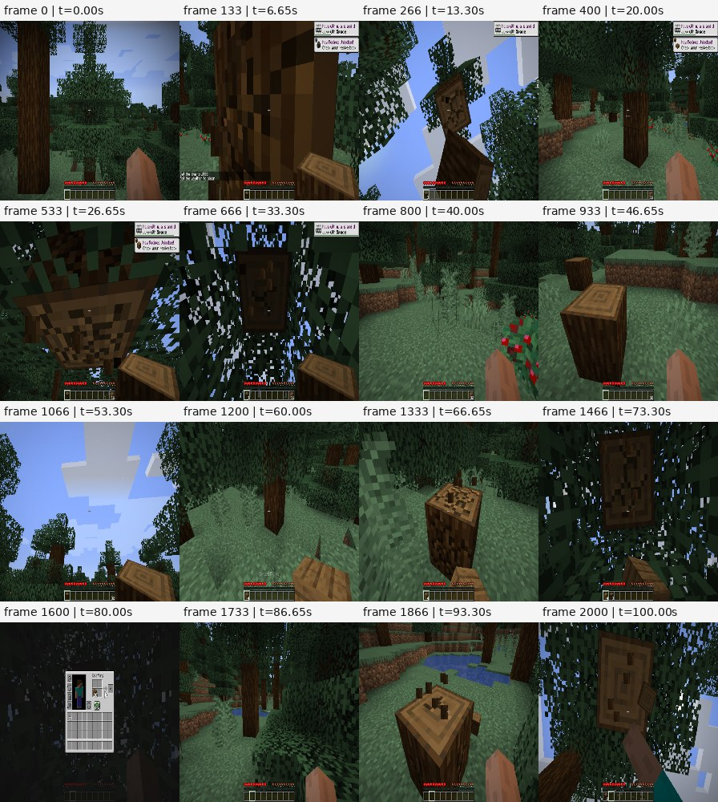

# GPU 与轨迹行为验证

2026-09-28，`2.0.0a2`。**VPT foundation 1x 和挖钻石 RL 2x 的权重加载、CUDA 推理、状态传递与动作执行已在本机验证。**
RL 2x 的 2,000 步录像呈现连续的接近树木、砍树、抬头和合成过程。
存在局部急转、短按键和无效合成；这次验证不代表策略已能稳定挖到钻石。

## 运行条件

| 项目 | 实际配置 |
| --- | --- |
| Python / Torch | 3.12.3 / 2.14.0+cu130，独立 `.venv-stage2-gpu` |
| GPU / 驱动 | 单张 NVIDIA H800 PCIe 80 GB / 590.48.01 |
| 推理 | `cuda:0`，TF32 关闭，float32 |
| GPU 渲染 | VirtualGL 3.1.5 + Xvfb，OpenGL vendor 为 NVIDIA，renderer 为 H800 |
| 游戏 | Java 8；引擎身份见[阶段二验证记录](stage2-validation.md) |
| 图像 | 游戏 640×360 → 轨迹 224×224 → VPT 128×128，线性缩放 |
| 种子 / 动作 | 环境 42，Torch 13；原始动作，无平滑、插帧或重复动作处理 |

`nvidia-smi` 同时记录到 Python CUDA 计算进程和 Java 图形进程。
最初两段只使用 CUDA 推理，VirtualGL 的库未成功预加载；后续两段已确认实际 GPU 渲染。下文明确区分。

## 加载与数值证据

foundation 1x 的 revision、配置和权重摘要见[固定资源身份](stage2-validation.md#fixed-resources)。
挖钻石模型沿用旧版教程指定的 `CraftJarvis/MineStudio_VPT.rl_from_early_game_2x`：

| 身份 | 值 |
| --- | --- |
| revision | `3db1bf4e2c0e121df128deed9ee1622f19c339ff` |
| 源权重 SHA-256 | `d6793de99d5cc0cbcfc4680164ab6c7ec94dd96b7db8c9101034bddf193193a3` |
| 源配置 SHA-256 | `22092301c7db0d1306208b12f3c5b2097c9f5fc8d25a3c8f2a9ae928934fec9d` |

两套权重均经严格转换，没有缺失或忽略参数。再次加载后，**全部 134 个 state-dict 张量分别与各自源权重精确相等**。
使用实际录制的 foundation 400 帧和 RL 2x 2,000 帧，逐步重放原始 v1 网络类定义和 v2 API：

- CUDA 网络输出、recurrent state 逐项精确一致，`rtol=atol=0`，跨过 128 帧缓存边界。
- 恢复同一 CUDA RNG 状态后，v1/v2 的随机采样动作全部一致。
- 重放动作与录制时的动作全部吻合，behavior log probability 最大误差为 0。
- 新 codec 与保留的旧 codec 解码一致；各步状态均实际更新。

对照使用原始 v1 网络类和保留的共享 head 组件，并非独立的 OpenAI 官方运行时。
这证明本次迁移与记录链路一致，不将相同的策略局限解释为迁移成功率。

另以 160 帧固定随机输入对照 CPU/CUDA：确定性动作 160/160 相同，但浮点结果不逐位相同。

| 对照项 | CPU/CUDA 最大绝对误差 |
| --- | ---: |
| 网络输出 | 0.00018823 |
| recurrent state | 0.00102234 |
| buttons / camera logits | 0.00014782 / 0.00010586 |
| value | 0.00000187 |

最初尝试的 `1e-4 + 1e-4 × abs(reference)` 界限有超出：网络 4/327,680 个元素、状态 83,756/167,854,080 个元素；
两类 logits 无超出。保留失败日志和完整误差，**不声称该 CPU/CUDA 容差检查通过**。
同一 GPU 上的 v1/v2 精确对照通过。预热后单流 API 中位耗时 CPU 51.99 ms、CUDA 6.92 ms；
559 MiB 的峰值 allocated 显存包含两份 GPU 网络，仅适用于该对照程序。

## 连续度与顺滑程度

| 策略 / 渲染 | 步数 / 帧数 | 路径长度 | 无物理按键比例¹ | 镜头转角 p95² | 镜头变化量 p95³ |
| --- | ---: | ---: | ---: | ---: | ---: |
| foundation 确定性 / 软件 | 400 / 401 | 22.24 m | 5.75% | 0.62° | 0° |
| foundation 随机 / 软件 | 400 / 401 | 2.16 m | 97.75% | 5.84° | 6.57° |
| foundation 随机 / GPU | 400 / 401 | 1.76 m | 97.00% | 6.03° | 6.83° |
| RL 2x 随机 / GPU | 2,000 / 2,001 | 48.79 m | 21.50% | 8.22° | 6.64° |

¹ 不含 camera，不能直接解读为完全空闲。² 每步 pitch/yaw 二维向量的范数。
³ 相邻两步镜头指令之差的范数，包含 GUI 时段；这是描述性指标，没有设为通用通过门槛。

四段轨迹均通过 reader 摘要校验与 T+1 读回；视频帧数一致，时间戳严格递增，每帧间隔 0.05 秒。
未发现黑帧或连续完全重复的原始观测；最大单步位移均小于 0.61 m。
这些记录完整性检查结合逐帧抽查支持画面连续，但不能单凭无重复帧证明游戏始终无卡顿。

`custom.play_one_minute` 计数有两段出现暂存后补齐：确定性 foundation 5/400 处、RL 2x 10/2,000 处，
累计增量分别仍为 400 和 2,000；两段随机 foundation 均逐步 +1。
已查看异常附近的连续帧和位置，未发现相应的重复画面或传送。
旧引擎源码从客户端统计缓存读取该字段，与短暂滞后的解释一致；未改写统计值，尚未证明所有遥测严格同步。

### 挖钻石模型的实际表现



RL 2x 能连续接近树木、保持 attack 砍树、转头寻找剩余木块，再打开背包合成。
最终遥测记录挖掉 **16 块云杉原木、3 块树叶、1 株大型蕨**，合成 **52 块木板和 52 个云杉按钮**；
背包剩余 2 块原木和 52 个按钮，没有钻石，以 `task_time_limit` 结束。
TaskSpec 的文字指令用于描述和记录；VPT 是视觉策略，不会直接读取这段文字。

录像抽帧及镜头变化最大的连续 16 帧均已检查：场景衔接正常，转向期间有局部明显急转，不能称为全程平滑。
RL 2x 的非 GUI 相邻观测共 1,513 对，实际 pitch/yaw 响应相对指令的最大误差为 **0.000057°**。
461 帧处于 GUI；这时 camera 控制光标，因此不按角色转角检查，避免误报动作错位。
按键切换总计 5.01 次/模拟秒，包含合成点击与短按；不能单独据此判断抖动。

foundation 确定性模式镜头较稳，但后半段持续面对树叶、位移停滞；随机模式大量原地转动视角。
RL 2x 的行为更适合确认动作链路。大量合成按钮仍是本次观察到的策略表现，不能据此宣称钻石任务能力恢复。
单次种子、100 秒预算、两级缩放也限制了行为结论；并未开展长期任务成功率或多种子评估。

## 修复与回归

- GPU 设备选择修复未定义的 CUDA 驱动引用，兼容 `cuda.bindings.driver` 与旧 `cuda.cuda`，保留可见设备顺序，验证 DRM 节点；显式 GPU 请求失败时直接报错。
- Java 启动前，用相同设备与环境检查 VirtualGL 的实际 NVIDIA OpenGL renderer；预加载失败或 Mesa 回退时停止启动。
- VPT 导出/状态测试在 CUDA 可用时增加 CUDA 参数；真实 e2e 支持 `MINESTUDIO_POLICY_DEVICE=cuda:0`。
- CPU 环境 unit/integration **74 passed**；CUDA 环境 **75 passed**，均无跳过。CUDA 环境额外执行同一导出/状态用例的 GPU 参数。

## 本机复现与产物

运行文件保存在被 Git 忽略的 `runs/stage2-gpu/`，大模型、原始轨迹和日志不进入发行包。

| 路径（相对项目根目录） | 内容 |
| --- | --- |
| `runs/stage2-gpu/cuda-parity.json` | 160 帧 CPU/CUDA 与 CUDA v1/v2 对照 |
| `runs/stage2-gpu/real-observation-parity.json` | 两套源权重与 2,400 步真实观测重放 |
| `runs/stage2-gpu/analysis/metrics.json` | 四段轨迹的帧、tick、动作和行为指标 |
| `runs/stage2-gpu/REPORT.md` | 本地录像、图表与日志入口 |
| `runs/stage2-gpu/scripts/` | 下载、采样、重放、分析脚本 |
| `runs/stage2-gpu/logs/` | 执行与回归日志，含早期失败记录 |

资源就绪后，从项目根目录执行：

```bash
CUDA_VISIBLE_DEVICES=0 .venv-stage2-gpu/bin/python runs/stage2-gpu/scripts/replay-real-observations.py
.venv-stage2-gpu/bin/python runs/stage2-gpu/scripts/minestudio-analyze-behavior.py
CUDA_VISIBLE_DEVICES=0 .venv-stage2-gpu/bin/python -m pytest -q
```

本机重新采样的命令、VirtualGL 局部安装与 Python 库路径处理见 `runs/stage2-gpu/README.md`。
GPU 配置方式见[安装指南](../getting-started/installation.md#gpu)。其他 GPU、驱动、平台和模型仍需单独验证。
