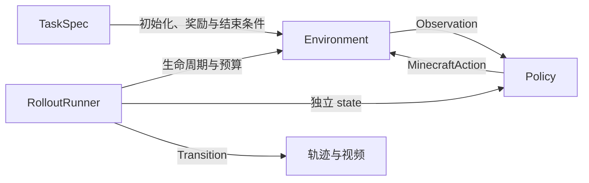

MineStudio · v2 alpha

# 从第一个动作，到可复现的 Minecraft 实验

定义任务，运行策略，留下可检查的轨迹、视频和评测结果。先用本地示例了解流程，再接入 Minecraft。
{ .ms-lead }

[开始使用](getting-started/quickstart.md){ .md-button .md-button--primary }
[查看实现进度](architecture/progress.md){ .md-button }

!!! info "当前版本：2.0.0a2"
    任务、轨迹读写、视频和评测已实现；Linux CPU 上的真实 Minecraft/VPT 短程采样与 1x 发布权重对照已通过。
    训练、历史数据迁移和分布式执行仍在后续阶段。[查看验证范围](architecture/stage2-validation.md)。

### 运行一个实验
几条命令生成评测 JSON、轨迹和可选的视频，确认安装与接口。

[打开快速入门 →](getting-started/quickstart.md)

### 定义研究任务
用 JSON、YAML 或 Python 配置初始化、奖励和成功条件。

[查看任务指南 →](guides/tasks.md)

### 检查实验结果
理解成功率、重试和失败记录，读回每一条有效转移。

[查看评测指南 →](guides/evaluation.md)

## 一次交互的边界

公共动作直接表达 Minecraft 控制量。VPT 等模型内部的离散编码由策略适配器处理。
[环境与动作](guides/environments.md)介绍具体的数据格式和生命周期。

## 按你的目标继续

| 我想…… | 从这里开始 |
| --- | --- |
| 接入自己的模型 | [策略协议与 VPT](guides/policies.md) |
| 运行真实游戏 | [引擎与依赖安装](getting-started/installation.md#minecraft-setup) |
| 检查或恢复一次采样 | [轨迹格式与读取](guides/trajectories.md) |
| 迁移 v1 研究代码 | [迁移指南](migration/v1-to-v2.md) |
| 为 v2 贡献功能 | [架构规范](architecture/v2.md) |
